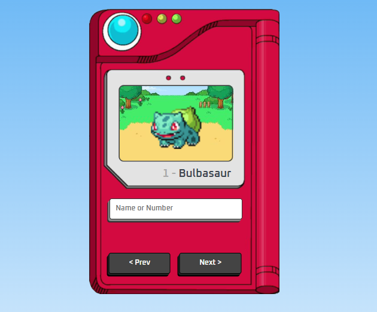

# Pokédex - Consulta à PokéAPI

Uma Pokédex interativa que consome dados da [PokéAPI](https://pokeapi.co/) para exibir o nome, número e imagem dos Pokémon. Navegue facilmente usando os botões **Próximo** e **Anterior**, ou pesquise diretamente pelo nome ou número.

---

## 🚀 Funcionalidades

- 🔍 Busca por nome ou número do Pokémon
- ⏮️ Botão para ver o Pokémon anterior
- ⏭️ Botão para ver o próximo Pokémon
- 🖼️ Exibição da imagem animada, nome e número

---

## 🛠️ Tecnologias utilizadas

- HTML5
- CSS3
- JavaScript
- [PokéAPI](https://pokeapi.co/)
